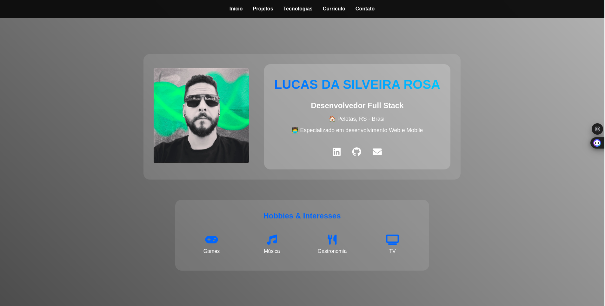

# Portfólio - Lucas S. Rosa

Portfólio pessoal desenvolvido com HTML, CSS e JavaScript puros, apresentando meus projetos e experiências como desenvolvedor Full Stack.

## 🚀 Tecnologias

- HTML5
- CSS3
- JavaScript
- Font Awesome (ícones)

## 💻 Funcionalidades

- Design responsivo
- Filtro de projetos por categoria
- Menu mobile interativo
- Seção de tecnologias com ícones
- Timeline de experiências
- Formulário de contato
- Botão "Voltar ao topo"
- Cards de projetos dinâmicos

## 🎨 Layout

O site está organizado nas seguintes seções:
- Home (Apresentação e Hobbies)
- Projetos
- Tecnologias
- Currículo
- Contato

## 🔗 Links

- [Site ao vivo](https://lucassrosa.surge.sh/)
- [LinkedIn](https://www.linkedin.com/in/lsrdev/)
- [GitHub](https://github.com/lucopdev)

## 📸 Preview

Para adicionar uma preview do seu site:
1. Tire um print da página inicial
2. Salve na pasta `assets` como `preview.png`
3. A imagem aparecerá automaticamente neste README

## 📝 Licença

Este projeto está sob a licença MIT. Veja o arquivo [LICENSE](LICENSE) para mais detalhes.

---

Feito com ♥ por Lucas S. Rosa
